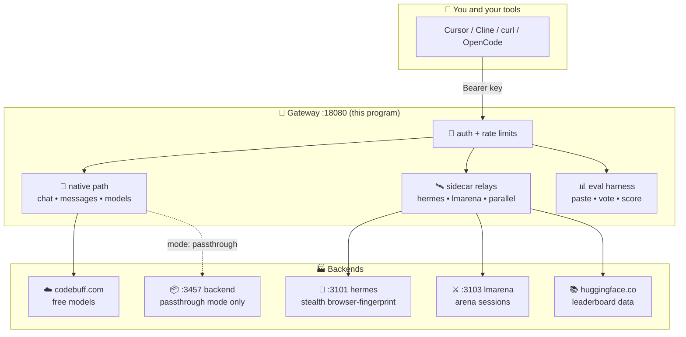
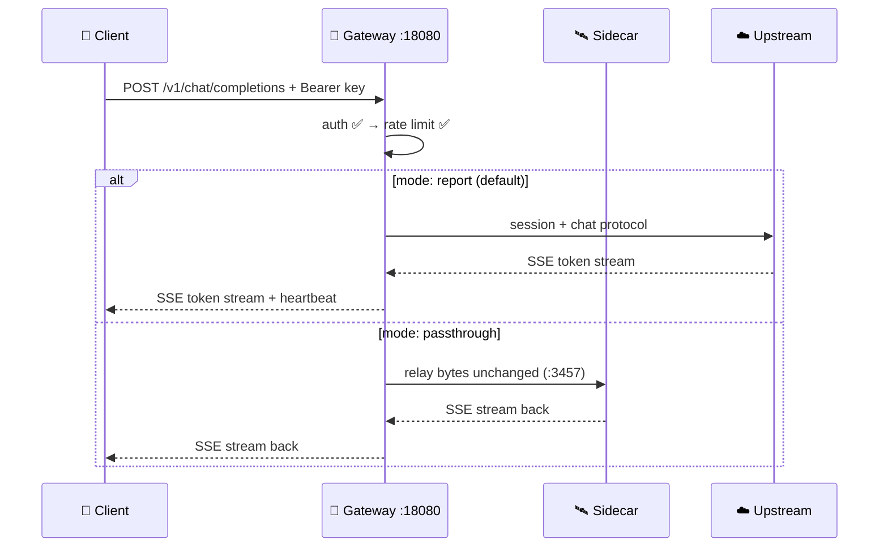
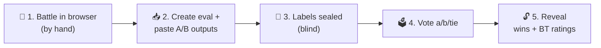

# freebuff-unified — Unified Freebuff Gateway


> **One-sentence version (grade-6 plain):** this is a single computer program
> that lets your coding tools talk to free AI models through one front door,
> using the same plug shapes (`/v1/chat/completions`, `/v1/messages`) that
> OpenAI and Anthropic tools already understand.

All the special code words in this file (`endpoint`, `sidecar`, `passthrough`,
`SSE`, `webhook`) are used with their exact coding meaning. The sentences
around them are kept short so the learning never stops.

---

## 1. The big picture — a discovery map



> [!NOTE]
> **Two modes, one program.** `mode: report` (default) = the gateway answers
> everything itself. `mode: passthrough` = `/v1/*` model traffic is relayed
> byte-by-byte to the `:3457` backend, while health, evals, sidecars and
> status stay native. Details in §5.

### Port atlas — every door, color-coded by job

| Port | Name | Job | Color |
|------|------|-----|-------|
| `:18080` | Gateway | 🟢 **front door** — everything below enters here | green = go here first |
| `:3457` | Backend | 🔵 **engine room** — token pool + sessions (passthrough only) | blue = machinery |
| `:3101` | Hermes | 🥷 **disguise kit** — browser-like TLS fingerprint + proxies | stealth |
| `:3103` | LMArena | ⚔️ **arena desk** — battle sessions + pasted-output evals | contests |
| `:9091` | Dashboard | 🖥️ **control room** — live status UI + SSE | watch |

---

## 2. Word bank — code vocabulary, plain meanings

> [!TIP]
> Read this table once and every other section gets easier. Code words are
> **bold** and always mean exactly what they mean in code.

| Code word | Plain meaning (grade 6) | Example here |
|-----------|-------------------------|--------------|
| **endpoint** | A URL door that does one job | `POST /v1/lmarena/evals` starts a contest |
| **sidecar** | A small helper program riding next to the main one | Node service on `:3101` |
| **passthrough** | Passing a letter on unopened to someone else | `/v1/*` → `:3457` backend |
| **SSE** | Server-Sent Events — the server taps out messages line by line | Streaming answers |
| **relay** | Forwarding bytes without changing them | Gateway → sidecar |
| **session** | A remembered conversation key | `sessionId` UUID |
| **rate limit** | Max turns per minute, so nobody hogs the swing | `client_rpm: 60` |
| **sealed** | Hidden until the big reveal, like a vote count | Model names in evals |
| **Bradley-Terry** | A fairness math that turns wins into ratings | `bt_ratings` in scores |
| **cache** | Yesterday's answers kept in a drawer for speed | Leaderboard snapshot |
| **stale-while-revalidate** | Serve the drawer copy while fetching a fresh one | HF downtime safety |

---

## 3. Version ledger — what version is what

| Piece | Version | Where it is written |
|-------|---------|---------------------|
| Go toolchain | `1.26` | `go.mod` |
| Fiber web frame | `v3.3.0` | `go.mod` |
| uTLS fingerprint lib | `v1.8.2` | `go.mod` (dropped `circl`, uses stdlib crypto) |
| Node runtime | `v22.22.1` | system |
| Hermes sidecar | `1.0.0` | `deps/hermes-service/package.json` |
| LMArena sidecar | `1.0.0` | `deps/lmarena-stealth-proxy/package.json` |
| Gateway config shape | `unified-v1` | `/healthz` payload |
| Leaderboard data | `2026-09-11` snapshot | `/v1/lmarena/leaderboard` (`updated` field) |

---

## 4. Installation guide — from zero to running

### Step 0 — What you need (ingredients)

- [ ] Linux machine (this guide uses `systemd`)
- [ ] Go `>= 1.26` (only to build; prod runs the compiled binary)
- [ ] Node `>= 14` (sidecars; prod uses v22)
- [ ] `git`, `curl`

### Step 1 — Get the code and build

```bash
git clone https://github.com/marktantongco/unified-freebuff-proxy.git
cd unified-freebuff-proxy
# (gateway source lives in this tree)
go build -o bin/freebuff-unified ./cmd/freebuff
```

### Step 2 — Configure (keys stay out of git)

```bash
cp config.example.yaml config.yaml
# open config.yaml and set your server.api_keys + auth.api_keys
./bin/freebuff-unified check   # prints every block it understood
```

> [!WARNING]
> `config.yaml` holds **real keys** and is git-ignored on purpose. Never
> `git add` it. The committed template is `config.example.yaml` with
> `fbu_CHANGE_ME_*` placeholders.

### Step 3 — Start the sidecars, then the gateway

```bash
# manual mode (learning):
PORT=3101 npm start --prefix deps/hermes-service &
PORT=3103 npm start --prefix deps/lmarena-stealth-proxy &
./bin/freebuff-unified serve

# service mode (prod) — survives reboot:
sudo cp deploy/systemd/*.service /etc/systemd/system/
sudo systemctl daemon-reload
sudo systemctl enable --now hermes-sidecar.service \
  lmarena-stealth-proxy.service freebuff-unified.service
```

### Step 4 — Prove it works (checklist)

```bash
KEY=fbu_YOUR_first_key
curl http://127.0.0.1:18080/healthz                                   # 200 + ai_stack
curl -H "Authorization: Bearer $KEY" http://127.0.0.1:18080/v1/models # model list
curl -H "Authorization: Bearer $KEY" http://127.0.0.1:18080/lmarena/healthz
curl -H "Authorization: Bearer $KEY" "http://127.0.0.1:18080/v1/lmarena/leaderboard?top=1"
```

- [ ] All four return `200`
- [ ] A call **without** the key returns `401`
- [ ] `journalctl -u freebuff-unified.service` shows `listening on :18080`

---

## 5. How a request travels — the thorough process summary



**In plain steps (grade 6):**

1. **Knock** — your tool knocks on `:18080` with a secret key.
2. **ID check** — the `auth` guard checks the key (`401` if wrong).
3. **Speed check** — the `limiter` counts turns per minute (`429` if too fast).
4. **Routing** — model doors (`/v1/*`) go native **or** passthrough; sidecar
   doors (`/v1/hermes/*`, `/v1/lmarena/*`, `/v1/parallel/*`, evals,
   leaderboard) **always** stay native, in both modes.
5. **Heartbeat** — every `15s` the server taps `: keep-alive` so clinics,
   load-balancers and Cloudflare never hang up a long answer (the old
   “no data for 5 minutes” abort).
6. **Answer** — tokens stream back as SSE; non-stream doors wait and return
   one JSON (with whitespace heartbeats past `15s`).

> [!IMPORTANT]
> **Safety rule the code enforces:** streaming callbacks never touch the
> request object after the handler returns (Fiber recycles it — a
> use-after-release race we caught with `-race` and fixed). Contexts and
> disconnect channels are copied **before** streaming starts. Full suite
> passes with `-race`: **95 tests, 18 packages**.

---

## 6. Config tour — every knob, plain words

| Block | What it decides | Key players |
|-------|-----------------|-------------|
| `server` | Which port + which keys open the door | `listen: ":18080"`, `api_keys` |
| `upstream` | Which free-model cloud + default brain | `base_url`, `default_model` |
| `auth` | Login breaker (locks out after failures) | `threshold: 3`, `cooldown: 12h` |
| `stealth` | Disguise + proxy pool refresh | `enabled`, `us_proxies`, `proxy_refresh_mins` |
| `limits` | Three speed limits | `global_rpm`, `account_rpm`, `client_rpm` |
| `proxy` | Report vs passthrough + backend address | `mode`, `backend_url` |
| `dashboard` | Control-room address | `addr: ":9091"` |
| `hermes` | Disguise-kit address | `base_url: :3101` |
| `lmarena` | Arena desk + eval drawer + leaderboard | `base_url: :3103`, `eval_dir`, `leaderboard*` |
| `parallel` | Web search/extract APIs (key optional) | `base_url`, `default_mode` |
| `research` | Deep-research planner limits | `max_queries`, `fan_out`, `timeout_ms` |

---

## 7. Endpoint catalog — every door, one line each

🔓 = public (no key) · 🔑 = needs `Authorization: Bearer` (or `x-api-key`)

| Door | Key | Job |
|------|-----|-----|
| `GET /healthz` | 🔓 | “Are you alive?” + version + pools |
| `GET /ai-stack/status` | 🔓 | Whole machine report (gateway, sidecars, pools, leaderboard top-5) |
| `GET /proxy/verify` | 🔓 | Backend reachability probe |
| `GET /v1/models` | 🔑 | Which models your account gets |
| `POST /v1/chat/completions` | 🔑 | Chat (stream with `"stream": true`) |
| `POST /v1/messages` | 🔑 | Anthropic-shaped chat |
| `POST /v1/messages/count_tokens` | 🔑 | Count tokens before sending |
| `POST /v1/deep-research` | 🔑 | Research job (plan → search → cited report) |
| `POST /v1/responses` | 🔑 | Responses-shaped relay/fallback |
| `GET /hermes/healthz` | 🔑 | Disguise-kit pulse |
| `GET /stealth/status` | 🔑 | Egress + pool metrics |
| `POST /v1/hermes/fetch` | 🔑 | One stealth web fetch |
| `POST /v1/parallel/search` | 🔑 | Web search (keyless DDG fallback) |
| `POST /v1/parallel/extract` | 🔑 | Read a page to text |
| `GET /lmarena/healthz` | 🔑 | Arena-desk pulse |
| `ALL /v1/lmarena/v1/*` | 🔑 | Relayed to `:3103` sidecar |
| `POST /v1/lmarena/evals` | 🔑 | Start a blind contest |
| `POST /v1/lmarena/evals/:id/rounds` | 🔑 | Paste one A/B round (labels seal) |
| `POST /v1/lmarena/evals/:id/import` | 🔑 | Bulk paste JSONL/CSV (≤500) |
| `POST /v1/lmarena/evals/:id/rounds/:rid/vote` | 🔑 | Vote `a` / `b` / `tie` (once) |
| `POST /v1/lmarena/evals/:id/reveal` | 🔑 | Unseal + score (wins + BT ratings) |
| `GET /v1/lmarena/leaderboard` | 🔑 | Public ratings (`?category=&top=`) |

---

## 8. Eval harness walkthrough — run a fair contest



```bash
KEY=fbu_YOUR_key; B=http://127.0.0.1:18080
ID=$(curl -s -X POST -H "Authorization: Bearer $KEY" \
  -d '{"name":"friday-battle"}' $B/v1/lmarena/evals | python3 -c "import sys,json;print(json.load(sys.stdin)['eval']['id'])")
curl -s -X POST -H "Authorization: Bearer $KEY" -H "Content-Type: application/json" \
  -d '{"prompt":"Explain gravity","output_a":"...A...","output_b":"...B...","model_a":"zenith","model_b":"summit"}' \
  $B/v1/lmarena/evals/$ID/rounds   # labels sealed — response hides them
curl -s -X POST -H "Authorization: Bearer $KEY" -d '{"winner":"a"}' \
  $B/v1/lmarena/evals/$ID/rounds/$RID/vote
curl -s -X POST -H "Authorization: Bearer $KEY" $B/v1/lmarena/evals/$ID/reveal
```

> [!NOTE]
> **Bulk paste** skips one-by-one: `POST .../import` with
> `{"format":"jsonl"|"csv","data":"..."}` (CSV header:
> `prompt,output_a,output_b,model_a,model_b,winner`). Records with a winner
> arrive pre-voted. One bad record rejects the whole batch — no half-saves.
>
> **Fairness math:** `bt_ratings` use the Bradley-Terry method (same family
> as the official `arena-rank` package): each win lifts a model's rating,
> each loss lowers it, ties split half-half, on the classic Elo-400 scale
> starting at `1000`. A tiny tie-prior keeps small contests sane.

<details>
<summary>📐 Peek at the math (optional, still grade-6)</summary>

`P(A beats B) = 1 / (1 + 10^(-(RatingA - RatingB)/400))` — a 400-point gap
means ~91% win chance. Ratings are zero-centered so the average model sits
at `1000`. Sealed rounds never enter the math: blindness first, ratings
second.
</details>

---

## 9. Troubleshooting — symptom → fix

| 🔴 Symptom | 🟡 Likely cause | 🟢 Fix |
|------------|-----------------|--------|
| `401` everywhere | Wrong/missing key | Copy exact `fbu_...` from `config.yaml` |
| `429` | Too fast | Wait a minute; raise `*_rpm` if yours |
| `/v1/*` 404 in prod | Backend `:3457` down | `systemctl status freebuff-proxy` |
| Sidecar `502/503` | `:3101`/`:3103` down | `systemctl restart hermes-sidecar lmarena-stealth-proxy` |
| Empty answer after 5 min | Old binary without heartbeat | Rebuild + restart (fixed; heartbeats every `15s`) |
| `evals/` missing files | Normal — git-ignored by design | Check `lmarena.eval_dir` path |

---

## 10. History, family & rules

- `SESSION_SUMMARY.md` — 2026-09-03 three-lineage merge log
- `planning/2026-09-09-freebuff-slow-investigation.md` — 5-minute-abort root cause
- `planning/2026-09-09-unification-audit.md` — duplication/drift/security audit
- `docs/backend-installer.md` — `:3457` backend installer guide (upstream packaging)
- Family: `trefeon/freebuff-proxy` (MIT) · `Quorinex/FreeBuff2API` (MIT) ·
  `kori-lab/hermes` · leaderboard data: `lmarena-ai/leaderboard-dataset`
  (CC-BY-4.0). This repo unifies ideas; it is not a fork.
- Backend install: `scripts/install.sh` (see `docs/backend-installer.md`).
- License: MIT (`LICENSE`).
- Contributing: small focused PRs; `go build ./...` + `go vet ./...` +
  `go test ./...` (and `-race` for streaming changes) must all pass.

```diff
+ green = doors that answer
- red = doors that are down
! yellow = doors that need your key
# gray = doors owned by the backend in passthrough mode
```
